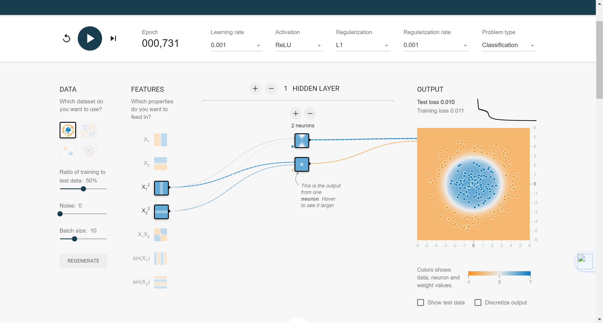
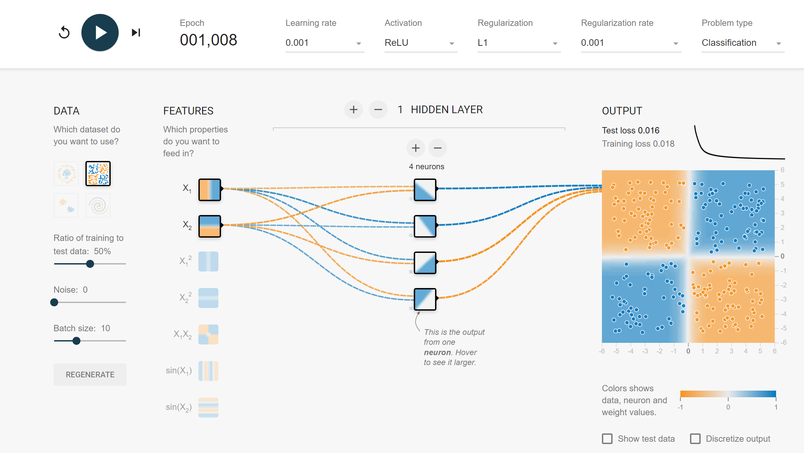
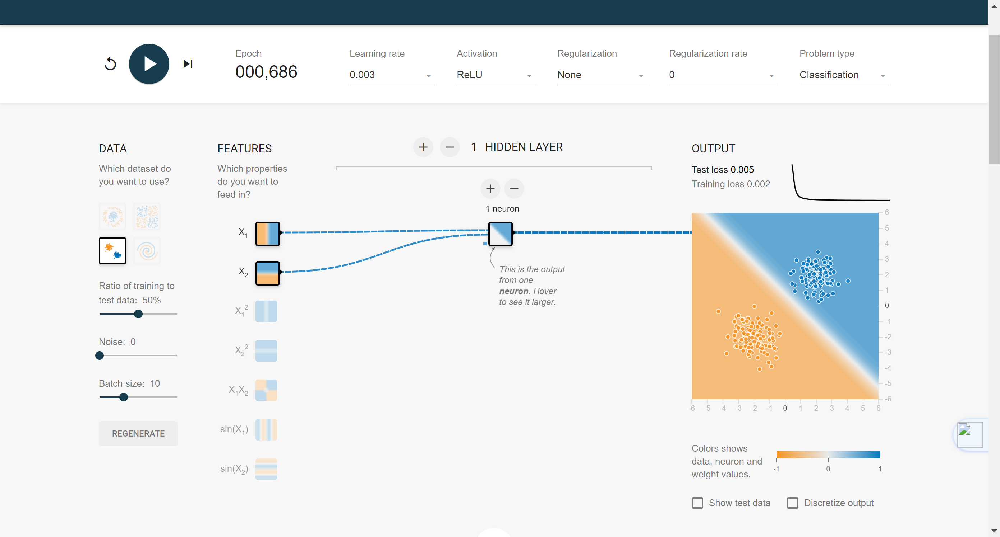
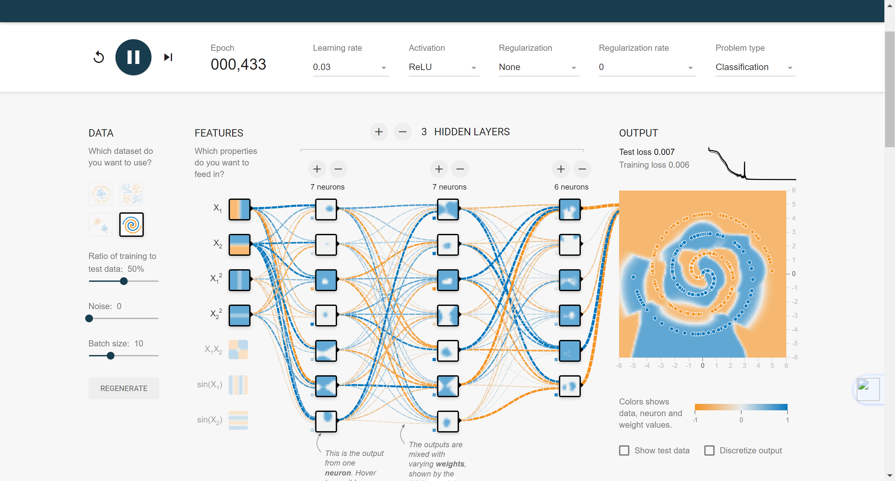

# 
Computer Vision
### 
Class Assignment 1

##### 
CS2110 &nbsp;&nbsp;&nbsp;&nbsp;&nbsp;&nbsp;&nbsp;&nbsp;&nbsp;&nbsp;&nbsp;&nbsp;&nbsp;&nbsp;&nbsp;&nbsp;&nbsp;&nbsp;&nbsp; U2021XXXXX  &nbsp;&nbsp;&nbsp;&nbsp;&nbsp;&nbsp;&nbsp;&nbsp;&nbsp;&nbsp;&nbsp;&nbsp;&nbsp;&nbsp;&nbsp;&nbsp;&nbsp;&nbsp;&nbsp;Gao Lang

---
### 
Task1

**Question**
Assuming we have a $50\times 50$ RGB image, and we use a fully connected layer with 100 neurons for feature extraction. How many trainable parameters does this layer have (including biases)?[10 points]

**Solution**
For a fully connected layer,each neuron is connected to every single input from the previous layer.That is ,in this senario,each neuron of the layer has $50\times50\times3=7,500$ connections(note that an RGB image has 3 channels)
For every connection,there is a corresponding trainable weight parameter.Therefore,each neuron has $7500\times 1=7,500$ trainable parameters in this case.Besides,for each neuron,there is also one bias parameter,which makes the layer have $100\times(7500+1)=750,100$ parameters in total.

### 
Task2

**Question**
Assuming the input is a 50x50 RGB image, and we use 100 convolutional kernels of size 3x3 for feature extraction. The convolutional layer would have a total of how many learnable parameters, including biases?[10 points]

**Solution**

The number of trainable parameters (with bias) in a convolutional layer can be calculated using the following formula:
$$N=(s^2\times D_{in}+1)\times D_{out}$$
where $N$ is total number of trainable parameters,$s$ means size of convolutional kernels,and $D_{in},D_{out}$ refers to input channels and output channels,separately.Note that $1$ means bias of output channels,and $D_{out}$ equals numbers of kernels,which is 100 here.
Using this formula, we would know that we have
$$(3^2\times 3+1)\times 100=2,800$$
trainable parameters in total.

### 
Task3

**Question**
Assuming the input feature map has a dimension of 63×63×16, we use 36 convolutional kernels of size 5×5 to extract features with a stride of 2 and padding of 2.What is the output feature map dimension?[10 points]

**Solution**
The dimension of output feature map can be discribed as $$D=(d_{width},d_{height},d_{channel})$$We know that $d_{channel}$ equals numbers of kernels,which is 36 here.And $d_{width},d_{height}$ can be calculated through following formula:$$d=(d_{in}-d_{kernel}+2\times p)/s+1$$where $p$ means padding and $s$ means stride. 
Here,when calculating $d_{width}$,we have $d_{in}=63$ and $d_{kernel}=5$.So we get $$d_{width}=(63-5+2\times 2)/2+1=32.$$
And we also get $d_{height}=32$ in the same way.Therefore,the output feature map has a dimension of $32\times 32\times 36$.

### 
Task4

**Question**
Assuming the input feature map has a dimension of $63×63×16$, we use 36 convolutional kernels of size $7×7$ with a stride of $1$ for feature extraction. To achieve equal width after convolution, what should the padding be set to?[10 points]

**Solution**
In Task3,we proposed a formula to calculate dimensions of output feature map,which is :$$d=(d_{in}-d_{kernel}+2\times p)/s+1.$$Here,we need to maintain the original $d_{width}$ after convolution. So we substitude $d=d_{in}=63,d_{kernel}=7,s=1$ into this formula:
$$63=(63-7+2\times p)/1+1$$
and finally we get $p=3$.

### 
Task5

**Question**
Design neural network architectures (in the middle section of the page) in TensorFlow Playground (http://playground.tensorflow.org/) to complete binary classification tasks for four datasets (on the left side of the page). Try to use the smallest neural network possible (with the least number of neurons). You can modify network architecture, learning rate, activation function, and regularization terms. Use the default training and testing set split ratio, noise level, and batch size. Provide a screenshot of the final experimental result (including network architecture, parameter settings, and final classification results).    

**Solution**
In this experiment,I adjusted the learning rate, regularization term, activation function, and input to make the model have a test loss of less than 0.01 under as simple conditions as possible. The following figure reflects my experimental results.

|Dataset|Lr|Activation|Regularize|Regularize Params|Layers|Neurons|
|:---:|:---:|:---:|:---:|:---:|:---:|:---:|
|1|0.01|Sigmoid|L2|0.003|2|1|
|2|0.01|Tanh|L1|0.001|2|1|
|3|0.003|Relu|None|0|2|1|
|4|0.03|Relu|None|0|4|20|

table1 Experimental Results

The actual experimental results are shown in the screenshot below.

img1 Experiments Results Screenshot